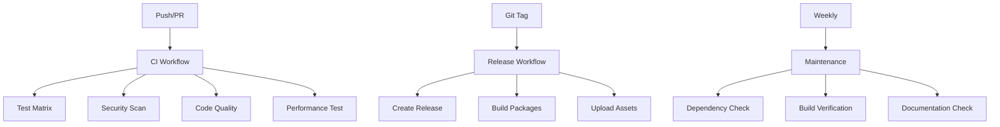

# GitHub Actions Workflows

This directory contains GitHub Actions workflows for automated CI/CD, testing, and maintenance of the LearnMorseCode project.

## Workflows Overview

### 🔄 CI (`ci.yml`)
**Triggers:** Push to `main`/`develop`, Pull Requests
**Purpose:** Comprehensive testing and validation

**Features:**
- ✅ Tests on macOS 14, 15, and latest (macOS 26+)
- ✅ Builds debug and release versions
- ✅ Verifies version handling and auto-versioning
- ✅ Security scanning for hardcoded secrets
- ✅ Code quality checks
- ✅ Performance testing
- ✅ Builds distribution packages (main branch only)

**Matrix Strategy:**
```yaml
macos-14 → Xcode 15.4
macos-15 → Xcode 16.2  
macos-latest → Xcode 16.2
```

### 🚀 Release (`release.yml`)
**Triggers:** Git tags (`v*`), Manual dispatch
**Purpose:** Automated release creation and distribution

**Features:**
- ✅ Creates GitHub releases with detailed changelog
- ✅ Builds Universal and Silicon packages
- ✅ Uploads DMG and ZIP files
- ✅ Includes release notes and checksums
- ✅ Supports manual version specification

**Usage:**
```bash
# Automatic (from git tag)
git tag v10.2025-15.3
git push origin v10.2025-15.3

# Manual (via GitHub UI)
# Go to Actions → Release → Run workflow
# Specify version: 10.2025, build: 15.3
```

### 🔍 Pull Request Tests (`pr-test.yml`)
**Triggers:** Pull requests to `main`/`develop`
**Purpose:** PR-specific validation and feedback

**Features:**
- ✅ Quality checks for PR changes
- ✅ Compatibility testing across macOS versions
- ✅ Automated PR comments with results
- ✅ Breaking change detection
- ✅ Build verification

### 🛠️ Maintenance (`maintenance.yml`)
**Triggers:** Weekly schedule (Sundays 2 AM UTC), Manual dispatch
**Purpose:** Regular maintenance and health checks

**Features:**
- ✅ Dependency security scanning
- ✅ Code quality monitoring
- ✅ Build system verification
- ✅ Documentation checks
- ✅ Weekly maintenance reports

## Workflow Dependencies



## Required Secrets

No additional secrets are required beyond the default `GITHUB_TOKEN` which is automatically provided.

## Caching Strategy

The workflows use intelligent caching to speed up builds:

- **Swift Package Manager**: Cached based on `Package.resolved`
- **Xcode DerivedData**: Cached based on Swift source files
- **Build artifacts**: Reused across workflow runs

## Environment Requirements

### macOS Runners
- **macos-14**: macOS 14.0 with Xcode 15.4
- **macos-15**: macOS 15.0 with Xcode 16.2
- **macos-latest**: Latest macOS (26+) with Xcode 16.2

### Dependencies
- `create-dmg` (installed via Homebrew)
- Xcode command line tools
- Swift Package Manager

## Workflow Status Badges

Add these badges to your README:

```markdown


```

## Troubleshooting

### Common Issues

1. **Xcode Version Mismatch**
   - Ensure the specified Xcode version is available on the runner
   - Check GitHub's [available software](https://github.com/actions/runner-images) documentation

2. **Build Failures**
   - Check the build logs for specific error messages
   - Verify all dependencies are properly cached
   - Ensure the build script has execute permissions

3. **Test Failures**
   - Review test output for specific failing tests
   - Check if tests require specific system permissions
   - Verify test environment setup

4. **Release Upload Failures**
   - Ensure the release was created successfully
   - Check file paths and permissions
   - Verify asset file sizes are within GitHub limits

### Debug Commands

```bash
# Check workflow status
gh run list --workflow=ci.yml

# View workflow logs
gh run view <run-id> --log

# Re-run failed workflow
gh run rerun <run-id>
```

## Customization

### Adding New macOS Versions

1. Update the matrix strategy in `ci.yml`:
```yaml
matrix:
  os: [macos-14, macos-15, macos-latest, macos-16]  # Add new version
```

2. Add Xcode version mapping:
```yaml
include:
  - os: macos-16
    xcode: '16.3'  # Specify appropriate Xcode version
```

### Modifying Test Commands

Update the test steps in the workflows to include additional commands:

```yaml
- name: Custom Test
  run: |
    ./Scripts/build.sh test
    ./Scripts/custom-test.sh  # Add your custom tests
```

### Adding New Checks

Extend the security or quality checks by adding new steps:

```yaml
- name: Custom Security Check
  run: |
    # Your custom security checks here
    echo "Running custom security scan..."
```

## Best Practices

1. **Keep workflows fast**: Use caching and parallel jobs
2. **Fail fast**: Run quick checks first, expensive tests later
3. **Clear naming**: Use descriptive job and step names
4. **Proper secrets**: Never hardcode sensitive information
5. **Regular updates**: Keep actions and dependencies updated
6. **Documentation**: Keep this README updated with changes

## Support

For issues with the workflows:
1. Check the [GitHub Actions documentation](https://docs.github.com/en/actions)
2. Review the workflow logs for specific error messages
3. Open an issue in the repository with workflow details
