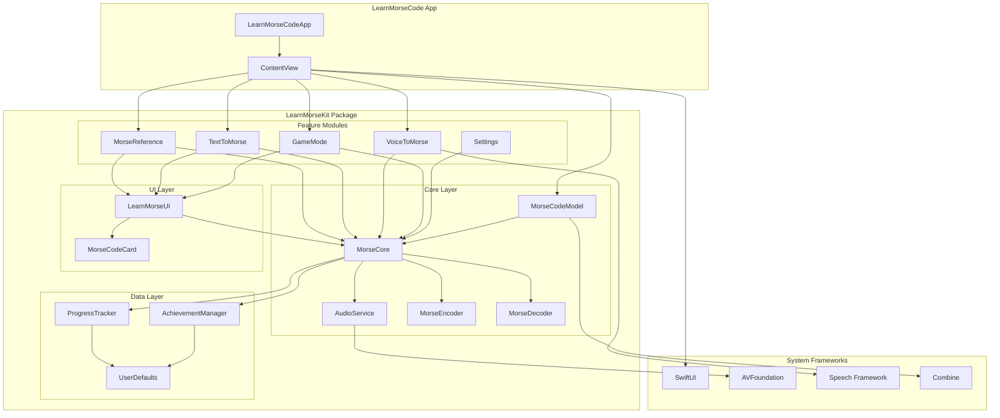

# LearnMorseCode


A comprehensive macOS application for learning Morse code through interactive features, games, and real-time audio feedback. Built with SwiftUI and a modular architecture, LearnMorseCode provides an engaging way to master Morse code communication.

## Table of Contents

- [Overview](#overview)
- [Features](#features)
- [Architecture](#architecture)
- [Installation](#installation)
- [Usage](#usage)
- [Development](#development)
- [Roadmap](#roadmap)
- [Contributing](#contributing)
- [License](#license)

## Overview

LearnMorseCode is a modern, interactive approach to learning Morse code. The application combines traditional learning methods with gamification, progress tracking, and real-time audio feedback to create an engaging learning experience.

### Key Objectives

- **Interactive Learning**: Convert text to Morse code and vice versa with real-time audio playback
- **Voice Integration**: Convert speech to Morse code for hands-free learning
- **Gamification**: Practice through interactive games with scoring and achievements
- **Progress Tracking**: Monitor learning progress with detailed statistics and achievements
- **Reference Guide**: Quick access to Morse code patterns and character mappings

## Features

### 🔤 Text ↔ Morse Conversion
- **Bidirectional Conversion**: Convert text to Morse code and Morse code back to text
- **Auto-Detection**: Automatically detects input type (text or Morse code)
- **Smart Formatting**: Handles continuous Morse code sequences and formats them properly
- **Real-time Audio**: Play converted Morse code with adjustable speed and volume
- **Visual Feedback**: Highlight currently playing characters during audio playback
- **Copy to Clipboard**: Easy sharing of converted content

### 🎤 Voice → Morse Conversion
- **Speech Recognition**: Convert spoken words directly to Morse code
- **Real-time Processing**: Live conversion as you speak
- **Audio Playback**: Hear the Morse code representation of your speech

### 🎮 Interactive Game Mode
- **Multiple Game Types**: Learn, Practice, and Challenge modes
- **Progressive Difficulty**: Start with basic characters and advance to complex sequences
- **Scoring System**: Track accuracy and speed improvements
- **Session Recording**: Save game sessions for progress tracking

### 📚 Morse Reference Guide
- **Complete Character Set**: All letters, numbers, and punctuation
- **Visual Patterns**: Clear dot-dash representations
- **Quick Lookup**: Search and filter characters
- **Audio Examples**: Hear each character's Morse code pattern

### 📊 Progress Tracking & Achievements
- **Session History**: Track all practice sessions with detailed statistics
- **Achievement System**: Unlock badges for milestones and accomplishments
- **Streak Tracking**: Monitor consecutive days of practice
- **Performance Analytics**: View accuracy trends and improvement over time
- **Character Mastery**: Track which characters you've learned

### ⚙️ Customizable Settings
- **Audio Controls**: Adjust playback speed (WPM) and volume
- **Visual Preferences**: Customize interface appearance
- **Learning Preferences**: Set difficulty levels and practice goals

## Architecture

LearnMorseCode follows a modular architecture using Swift Package Manager, making it maintainable and extensible.

### Architecture Diagram



### Core Modules

```
LearnMorseKit/
├── MorseCore/           # Core business logic and models
│   ├── Models/          # Data models and business logic
│   └── Services/        # Audio and encoding services
├── LearnMorseUI/        # Shared UI components
└── Features/            # Feature-specific modules
    ├── MorseReference/  # Reference guide functionality
    ├── TextToMorse/     # Text conversion features
    ├── VoiceToMorse/    # Voice recognition features
    ├── GameMode/        # Interactive games
    └── Settings/        # Application settings
```

### Key Components

- **MorseCodeModel**: Central data model managing state and business logic
- **AudioService**: Handles Morse code audio generation and playback with precise timing
- **MorseEncoder/Decoder**: Core encoding and decoding logic with error handling
- **ProgressTracker**: Manages user progress, sessions, and statistics
- **AchievementManager**: Handles achievement unlocking and tracking

### Technology Stack

- **SwiftUI**: Modern declarative UI framework
- **AVFoundation**: Audio generation and playback
- **Speech Framework**: Voice recognition capabilities
- **Combine**: Reactive programming for state management
- **Swift Package Manager**: Modular dependency management

## Installation

### Prerequisites

- macOS 14.0 or later
- Xcode 15.0 or later
- Swift 5.9 or later

### Building from Source

1. **Clone the repository**:
   ```bash
   git clone https://github.com/your-username/LearnMorseCode.git
   cd LearnMorseCode
   ```

2. **Open in Xcode**:
   ```bash
   open LearnMorseCode.xcodeproj
   ```

3. **Build and run**:
   - Select your target device/simulator
   - Press `Cmd + R` to build and run

### Using Build Scripts

The project includes convenient build scripts:

```bash
# Debug build and run
./build_and_run.sh

# Release build and run
./build_and_run_release.sh
```

## Usage

### Getting Started

1. **Launch the application** and explore the four main tabs:
   - **Reference**: Browse the complete Morse code character set
   - **Text↔Morse**: Convert between text and Morse code
   - **Voice→Morse**: Convert speech to Morse code
   - **Game**: Practice with interactive games

2. **Start with the Reference tab** to familiarize yourself with basic patterns

3. **Use Text↔Morse conversion** to practice encoding and decoding

4. **Try the Game mode** for structured learning with feedback

### Tips for Effective Learning

- **Start Slow**: Begin with a low words-per-minute (WPM) setting
- **Practice Daily**: Use the streak tracking to maintain consistent practice
- **Use Audio**: Always listen to the Morse code patterns while learning
- **Track Progress**: Monitor your achievements and session history
- **Mix Methods**: Combine reference study, conversion practice, and games

## Development

### Project Structure

```
LearnMorseCode/
├── LearnMorseCode/          # Main app target
├── LearnMorseCodeTests/     # Unit tests
├── LearnMorseCodeUITests/   # UI tests
├── Modules/                 # Swift Package modules
│   └── LearnMorseKit/       # Core package
└── Scripts/                 # Build and utility scripts
```

### Running Tests

```bash
# Run all tests with coverage
./run_tests_with_coverage.sh

# Run specific test suites
swift test --package-path Modules/LearnMorseKit
```

### Code Organization

- **Models**: Data structures and business logic in `MorseCore/Models/`
- **Services**: Audio and external service integrations in `MorseCore/Services/`
- **Views**: SwiftUI views organized by feature in `Features/`
- **UI Components**: Reusable components in `LearnMorseUI/`

## Roadmap

### Short-term Goals (Next 3 months)

- [ ] **Enhanced Voice Recognition**: Improve accuracy and add noise filtering
- [ ] **Advanced Game Modes**: Add timed challenges and multiplayer features
- [ ] **Custom Practice Sets**: Allow users to create custom character sets
- [ ] **Export/Import**: Share progress and settings between devices
- [ ] **Accessibility**: Enhanced VoiceOver support and keyboard navigation

### Medium-term Goals (3-6 months)

- [ ] **iOS Version**: Extend to iPhone and iPad with touch-optimized interface
- [ ] **Cloud Sync**: Sync progress across devices using iCloud
- [ ] **Advanced Analytics**: Detailed learning insights and recommendations
- [ ] **Community Features**: Share achievements and compete with others
- [ ] **Internationalization**: Support for multiple languages and Morse variants

### Long-term Vision (6+ months)

- [ ] **AI-Powered Learning**: Personalized learning paths based on progress
- [ ] **Real-time Communication**: Practice with other learners via Morse code
- [ ] **Professional Training**: Advanced features for radio operators and emergency responders
- [ ] **Educational Integration**: Tools for teachers and educational institutions
- [ ] **Hardware Integration**: Support for external Morse code keys and paddles

### Technical Improvements

- [ ] **Performance Optimization**: Reduce memory usage and improve audio latency
- [ ] **Offline Mode**: Full functionality without internet connection
- [ ] **Plugin System**: Allow third-party extensions and custom features
- [ ] **Advanced Audio**: Support for different tones, speeds, and audio effects
- [ ] **Machine Learning**: Improve voice recognition and learning recommendations

## Contributing

We welcome contributions to LearnMorseCode! Here's how you can help:

### Ways to Contribute

- **Bug Reports**: Report issues and unexpected behavior
- **Feature Requests**: Suggest new features or improvements
- **Code Contributions**: Submit pull requests for bug fixes or new features
- **Documentation**: Improve documentation and add examples
- **Testing**: Help test new features and report issues

### Development Guidelines

1. **Fork the repository** and create a feature branch
2. **Follow Swift style guidelines** and maintain code consistency
3. **Write tests** for new functionality
4. **Update documentation** for any API changes
5. **Submit a pull request** with a clear description of changes

### Code Style

- Use Swift's official style guidelines
- Prefer composition over inheritance
- Write self-documenting code with clear variable names
- Add comments for complex algorithms and business logic
- Maintain test coverage above 80%

## License

This project is licensed under the MIT License - see the [LICENSE](LICENSE) file for details.

## Acknowledgments

- Built with SwiftUI and modern macOS development practices
- Audio implementation based on ITU-R M.1677-1 international standard
- Special thanks to the Swift and SwiftUI communities for excellent documentation and resources

---

**Start your Morse code journey today!** 🎯

For questions, suggestions, or contributions, please open an issue or submit a pull request.
