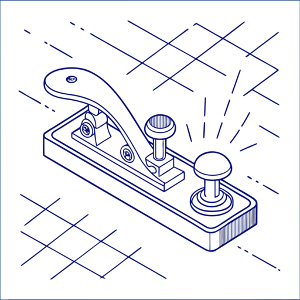
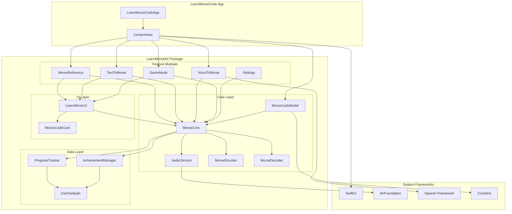

# LearnMorseCode



A comprehensive macOS application for learning Morse code through interactive features, games, and real-time audio feedback. Built with SwiftUI and a modular architecture, LearnMorseCode provides an engaging way to master Morse code communication.

## Table of Contents

- [Overview](#overview)
- [Features](#features)
- [Architecture](#architecture)
- [Installation](#installation)
- [Usage](#usage)
- [Development](#development)
- [Roadmap](#roadmap)
- [Contributing](#contributing)
- [License](#license)

## Overview

LearnMorseCode is a modern, interactive approach to learning Morse code. The application combines traditional learning methods with gamification, progress tracking, and real-time audio feedback to create an engaging learning experience.

### Key Objectives

- **Interactive Learning**: Convert text to Morse code and vice versa with real-time audio playback
- **Voice Integration**: Convert speech to Morse code for hands-free learning
- **Gamification**: Practice through interactive games with scoring and achievements
- **Progress Tracking**: Monitor learning progress with detailed statistics and achievements
- **Reference Guide**: Quick access to Morse code patterns and character mappings

## Features

### 🔤 Text ↔ Morse Conversion
- **Bidirectional Conversion**: Convert text to Morse code and Morse code back to text
- **Auto-Detection**: Automatically detects input type (text or Morse code)
- **Smart Formatting**: Handles continuous Morse code sequences and formats them properly
- **Real-time Audio**: Play converted Morse code with adjustable speed and volume
- **Visual Feedback**: Highlight currently playing characters during audio playback
- **Copy to Clipboard**: Easy sharing of converted content

### 🎤 Voice → Morse Conversion
- **Speech Recognition**: Convert spoken words directly to Morse code
- **Real-time Processing**: Live conversion as you speak
- **Audio Playback**: Hear the Morse code representation of your speech

### 🎮 Interactive Game Mode
- **Multiple Game Types**: Learn, Practice, and Challenge modes
- **Progressive Difficulty**: Start with basic characters and advance to complex sequences
- **Scoring System**: Track accuracy and speed improvements
- **Session Recording**: Save game sessions for progress tracking

### 📚 Morse Reference Guide
- **Complete Character Set**: All letters, numbers, and punctuation
- **Visual Patterns**: Clear dot-dash representations
- **Quick Lookup**: Search and filter characters
- **Audio Examples**: Hear each character's Morse code pattern

### 📊 Progress Tracking & Achievements
- **Session History**: Track all practice sessions with detailed statistics
- **Achievement System**: Unlock badges for milestones and accomplishments
- **Streak Tracking**: Monitor consecutive days of practice
- **Performance Analytics**: View accuracy trends and improvement over time
- **Character Mastery**: Track which characters you've learned

### ⚙️ Customizable Settings
- **Audio Controls**: Adjust playback speed (WPM) and volume
- **Visual Preferences**: Customize interface appearance
- **Learning Preferences**: Set difficulty levels and practice goals

## Architecture

LearnMorseCode follows a modular architecture using Swift Package Manager, making it maintainable and extensible.

### Architecture Diagram



### Core Modules

```
LearnMorseKit/
├── MorseCore/           # Core business logic and models
│   ├── Models/          # Data models and business logic
│   └── Services/        # Audio and encoding services
├── LearnMorseUI/        # Shared UI components
└── Features/            # Feature-specific modules
    ├── MorseReference/  # Reference guide functionality
    ├── TextToMorse/     # Text conversion features
    ├── VoiceToMorse/    # Voice recognition features
    ├── GameMode/        # Interactive games
    └── Settings/        # Application settings
```

### Key Components

- **MorseCodeModel**: Central data model managing state and business logic
- **AudioService**: Handles Morse code audio generation and playback with precise timing
- **MorseEncoder/Decoder**: Core encoding and decoding logic with error handling
- **ProgressTracker**: Manages user progress, sessions, and statistics
- **AchievementManager**: Handles achievement unlocking and tracking

### Technology Stack

- **SwiftUI**: Modern declarative UI framework
- **AVFoundation**: Audio generation and playback
- **Speech Framework**: Voice recognition capabilities
- **Combine**: Reactive programming for state management
- **Swift Package Manager**: Modular dependency management

## Installation

### Prerequisites

- macOS 14.0 or later
- Xcode 15.0 or later
- Swift 5.9 or later

### Building from Source

1. **Clone the repository**:
   ```bash
   git clone https://github.com/your-username/LearnMorseCode.git
   cd LearnMorseCode
   ```

2. **Open in Xcode**:
   ```bash
   open LearnMorseCode.xcodeproj
   ```

3. **Build and run**:
   - Select your target device/simulator
   - Press `Cmd + R` to build and run

### Using Build Scripts

The project includes a universal build script in the `Scripts/` folder:

```bash
# Debug build and run (default) - auto-increments build number
./Scripts/build.sh

# Release build and run - auto-increments build number
./Scripts/build.sh release

# Build and run app - auto-increments build number
./Scripts/build.sh run

# Run tests with coverage
./Scripts/build.sh test

# Build Universal + Silicon distribution packages - uses current tested version
./Scripts/build.sh packages

# Build packages with specific version (version parameters ignored - uses current tested version)
./Scripts/build.sh packages --version 10.2025

# Build packages with specific version and build number (version parameters ignored - uses current tested version)
./Scripts/build.sh packages --version 10.2025 --build 04.8

# Build packages with auto-generated version (auto-version ignored - uses current tested version)
./Scripts/build.sh packages --auto-version

# Clean build artifacts
./Scripts/build.sh clean
```

#### Available Scripts

| Script | Purpose | Usage |
|--------|---------|-------|
| `build.sh` | Universal build script | `./Scripts/build.sh [option]` |
| `grant_permissions_manual.sh` | Help with permission setup | `./Scripts/grant_permissions_manual.sh` |

#### Build Script Options

| Option | Purpose | Description |
|--------|---------|-------------|
| `debug` (default) | Debug build and run | Builds and launches debug version |
| `release` | Release build and run | Builds and launches optimized version |
| `test` | Run tests | Executes test suite with coverage |
| `packages` | Build distribution | Creates DMG/ZIP packages for distribution |
| `clean` | Clean artifacts | Removes all build artifacts |
| `help` | Show help | Displays usage information |

#### Version Parameters

| Parameter | Purpose | Example |
|-----------|---------|---------|
| `--version VERSION` | Set version number | `--version 10.2025` |
| `--build BUILD_NUMBER` | Set build number | `--build 04.8` |
| `--auto-version` | Auto-generate version | `--auto-version` |

**Default Values**: Version 1.0.0, Build 1

**Auto-Versioning Format**:
- Version: `month.year` (e.g., `10.2025` for October 2025)
- Build: `day.build_number` (e.g., `04.8` for day 04, build 8)
- Build number increments throughout the day, resets to 1 on new day

## Usage

### Getting Started

1. **Launch the application** and explore the four main tabs:
   - **Reference**: Browse the complete Morse code character set
   - **Text↔Morse**: Convert between text and Morse code
   - **Voice→Morse**: Convert speech to Morse code
   - **Game**: Practice with interactive games

2. **Start with the Reference tab** to familiarize yourself with basic patterns

3. **Use Text↔Morse conversion** to practice encoding and decoding

4. **Try the Game mode** for structured learning with feedback

### Tips for Effective Learning

- **Start Slow**: Begin with a low words-per-minute (WPM) setting
- **Practice Daily**: Use the streak tracking to maintain consistent practice
- **Use Audio**: Always listen to the Morse code patterns while learning
- **Track Progress**: Monitor your achievements and session history
- **Mix Methods**: Combine reference study, conversion practice, and games

## Development

### Project Structure

```
LearnMorseCode/
├── LearnMorseCode/          # Main app target
├── LearnMorseCodeTests/     # Unit tests
├── LearnMorseCodeUITests/   # UI tests
├── Modules/                 # Swift Package modules
│   └── LearnMorseKit/       # Core package
│       ├── Features/        # Feature modules
│       ├── MorseCore/       # Core Morse code logic
│       └── LearnMorseUI/    # Shared UI components
├── Scripts/                 # Build and utility scripts
│   ├── build.sh             # Universal build script
│   └── grant_permissions_manual.sh # Permission setup helper
├── Docs/                    # Documentation
│   └── setup_xcode_signing.md # Code signing guide
└── Tests/                   # Performance and integration tests
```

### Running Tests

```bash
# Run all tests with coverage
./Scripts/build.sh test

# Run specific test suites
swift test --package-path Modules/LearnMorseKit
```

## Continuous Integration

This project uses GitHub Actions for automated CI/CD:

### 🔄 Automated Testing
- **Multi-platform testing**: macOS 14, 15, and latest (macOS 26+)
- **Matrix builds**: Tests on different Xcode versions
- **Pull request validation**: Automatic testing on PRs
- **Security scanning**: Checks for vulnerabilities and hardcoded secrets

### 🚀 Automated Releases
- **Tag-based releases**: Create releases from git tags
- **Distribution packages**: Automatic DMG and ZIP creation
- **Release notes**: Auto-generated changelogs
- **Checksums**: Automatic verification files

### 🛠️ Maintenance
- **Weekly health checks**: Automated dependency and security scans
- **Code quality monitoring**: Regular formatting and quality checks
- **Build verification**: Ensures build system integrity

**Status Badges:**
[](https://github.com/your-username/LearnMorseCode/actions)
[](https://github.com/your-username/LearnMorseCode/actions)

For detailed workflow information, see [`.github/README.md`](.github/README.md).

### Code Organization

- **Models**: Data structures and business logic in `MorseCore/Models/`
- **Services**: Audio and external service integrations in `MorseCore/Services/`
- **Views**: SwiftUI views organized by feature in `Features/`
- **UI Components**: Reusable components in `LearnMorseUI/`

## Troubleshooting

### Microphone and Speech Recognition Issues

The Voice → Morse feature requires microphone and speech recognition permissions. If you're experiencing issues, follow these troubleshooting steps:

#### 🔧 **Issue: App Crashes on Voice → Morse Tab**

**Symptoms**: App crashes immediately when accessing Voice → Morse tab with error about missing usage descriptions.

**Solution**:
1. **Open the project in Xcode**:
   ```bash
   open LearnMorseCode.xcodeproj
   ```

2. **Add Privacy Usage Descriptions**:
   - Select the **LearnMorseCode** project (top item in navigator)
   - Select the **LearnMorseCode** target
   - Go to **Build Settings** tab
   - Search for `infoplist`
   - Under **Info.plist Values**, add these keys:
     - **Key**: `Privacy - Microphone Usage Description`
       **Value**: `This app uses the microphone to record your voice for speech recognition and Morse code learning.`
     - **Key**: `Privacy - Speech Recognition Usage Description`
       **Value**: `This app uses speech recognition to convert your voice to text, which is then translated to Morse code for learning purposes.`

3. **Clean and rebuild**:
   ```bash
   # In Xcode: Product → Clean Build Folder (Cmd+Shift+K)
   # Then build and run again (Cmd+R)
   ```

#### 🔧 **Issue: App Not Listed in System Settings**

**Symptoms**: App doesn't appear in System Settings → Privacy & Security → Microphone or Speech Recognition.

**Root Cause**: App is signed with "adhoc" signature instead of proper developer certificate.

**Solution**:
1. **Set up Code Signing in Xcode** (Recommended):
   - Follow the detailed guide: [Code Signing Setup Guide](Docs/setup_xcode_signing.md)
   - Open project in Xcode
   - Select **LearnMorseCode** target
   - Go to **Signing & Capabilities** tab
   - ✅ Check **"Automatically manage signing"**
   - Select your **Apple ID** in the Team dropdown
   - If you don't see your Apple ID, click **"Add Account..."** and sign in

2. **Quick Helper Script**:
   ```bash
   ./Scripts/grant_permissions_manual.sh
   ```
   This script will open System Settings to the microphone section and provide guidance.

3. **Clean and rebuild**:
   ```bash
   # In Xcode: Product → Clean Build Folder (Cmd+Shift+K)
   # Then build and run again (Cmd+R)
   ```

3. **Verify in System Settings**:
   - Go to **System Settings** → **Privacy & Security** → **Microphone**
   - You should now see **"LearnMorseCode"** in the list
   - Toggle the switch **ON** to grant permission
   - Repeat for **Speech Recognition** if it's a separate entry

#### 🔧 **Issue: "No Speech Detected" Error**

**Symptoms**: App starts recording but shows "No speech detected" even when speaking.

**Diagnostic Steps**:
1. **Check Microphone Hardware**:
   ```bash
   # Test with QuickTime Player
   # Open QuickTime Player → File → New Audio Recording
   # Click record and speak - you should see audio levels
   ```

2. **Check System Input Levels**:
   - Go to **System Settings** → **Sound** → **Input**
   - Speak and verify the input level meter moves
   - Ensure input volume is not muted

3. **Check App Permissions**:
   - Go to **System Settings** → **Privacy & Security** → **Microphone**
   - Verify **LearnMorseCode** is listed and enabled
   - Go to **System Settings** → **Privacy & Security** → **Speech Recognition**
   - Verify **LearnMorseCode** is listed and enabled

4. **Test with Different Audio Devices**:
   - In the app, try selecting different audio input devices from the dropdown
   - Test with both built-in microphone and any external microphones

#### 🔧 **Issue: Volume Level Always Shows 0%**

**Symptoms**: Volume level indicator in the app always shows 0% even when speaking.

**Possible Causes & Solutions**:

1. **Wrong Audio Device Selected**:
   - Check the audio device dropdown in the app
   - Try selecting different devices (Built-in Microphone, External Microphone, etc.)
   - Test each device by speaking

2. **Microphone Permissions Not Granted**:
   - Follow the "App Not Listed in System Settings" solution above
   - Ensure proper code signing is set up

3. **Audio Device Hardware Issue**:
   - Test microphone with other apps (QuickTime, FaceTime, etc.)
   - Check if microphone works with Siri
   - Try unplugging and reconnecting external microphones

#### 🔧 **Issue: Speech Recognition Not Working**

**Symptoms**: Microphone works but speech is not being recognized or converted to text.

**Solutions**:
1. **Check Speech Recognition Permissions**:
   - Go to **System Settings** → **Privacy & Security** → **Speech Recognition**
   - Ensure **LearnMorseCode** is listed and enabled

2. **Test Speech Recognition System-Wide**:
   - Try using **Dictation** in any text field (press Fn twice)
   - If system dictation doesn't work, there may be a system-level issue

3. **Check Internet Connection**:
   - Speech recognition may require internet connection for some features
   - Ensure you have a stable internet connection

4. **Restart the App**:
   - Quit the app completely
   - Reopen and try again

#### 🔧 **Issue: Audio Device Dropdown is Empty**

**Symptoms**: The audio device selection dropdown shows no options.

**Solution**:
1. **Restart the App**:
   - Quit the app completely
   - Reopen and navigate to Voice → Morse tab
   - The dropdown should populate with available devices

2. **Check Audio System**:
   - Go to **System Settings** → **Sound** → **Input**
   - Verify that input devices are detected by the system

#### 🔧 **Issue: App Shows Generic Device Names**

**Symptoms**: Dropdown shows "Default Input Device", "Built-in Microphone" instead of actual device names.

**Note**: This is expected behavior. The app uses generic device names that work across different Mac models to ensure compatibility.

**Verification**:
- The generic names still correspond to your actual hardware
- "Built-in Microphone" = your Mac's internal microphone
- "External Microphone" = any connected external microphones
- "Default Input Device" = system's current default input

#### 🔧 **Advanced Troubleshooting**

If the above steps don't resolve the issue:

1. **Reset Privacy Permissions**:
   ```bash
   # Reset all privacy permissions (use with caution)
   sudo tccutil reset All com.your-bundle-id.LearnMorseCode
   ```

2. **Check Console Logs**:
   - Open **Console.app**
   - Filter for "LearnMorseCode"
   - Look for error messages related to audio or speech recognition

3. **Test with Minimal Setup**:
   - Disconnect all external audio devices
   - Use only the built-in microphone
   - Test in a quiet environment

4. **System Requirements Check**:
   - Ensure macOS 14.0 or later
   - Check that you have sufficient disk space
   - Verify system audio is working properly

#### 🔧 **Development-Specific Issues**

If you're developing the app:

1. **Code Signing Issues**:
   - Ensure you're using a valid Apple Developer certificate
   - Check that the bundle identifier matches your provisioning profile
   - Verify that the app is not running in "adhoc" mode

2. **Build Configuration**:
   - Ensure privacy usage descriptions are properly set in build settings
   - Check that the app target includes required frameworks (AVFoundation, Speech)

3. **Testing on Different Machines**:
   - Test on different Mac models to ensure compatibility
   - Verify that the app works with different audio hardware configurations

### Getting Help

If you continue to experience issues:

1. **Check the Console**: Look for error messages in Console.app
2. **Test with Other Apps**: Verify that your microphone works with other applications
3. **System Updates**: Ensure your macOS is up to date
4. **Report Issues**: Open an issue on GitHub with:
   - macOS version
   - Mac model
   - Steps to reproduce
   - Console error messages (if any)
   - Screenshots of System Settings permissions

## Roadmap

### Short-term Goals (Next 3 months)

- [ ] **Enhanced Voice Recognition**: Improve accuracy and add noise filtering
- [ ] **Advanced Game Modes**: Add timed challenges and multiplayer features
- [ ] **Custom Practice Sets**: Allow users to create custom character sets
- [ ] **Export/Import**: Share progress and settings between devices
- [ ] **Accessibility**: Enhanced VoiceOver support and keyboard navigation

### Medium-term Goals (3-6 months)

- [ ] **iOS Version**: Extend to iPhone and iPad with touch-optimized interface
- [ ] **Cloud Sync**: Sync progress across devices using iCloud
- [ ] **Advanced Analytics**: Detailed learning insights and recommendations
- [ ] **Community Features**: Share achievements and compete with others
- [ ] **Internationalization**: Support for multiple languages and Morse variants

### Long-term Vision (6+ months)

- [ ] **AI-Powered Learning**: Personalized learning paths based on progress
- [ ] **Real-time Communication**: Practice with other learners via Morse code
- [ ] **Professional Training**: Advanced features for radio operators and emergency responders
- [ ] **Educational Integration**: Tools for teachers and educational institutions
- [ ] **Hardware Integration**: Support for external Morse code keys and paddles

### Technical Improvements

- [ ] **Performance Optimization**: Reduce memory usage and improve audio latency
- [ ] **Offline Mode**: Full functionality without internet connection
- [ ] **Plugin System**: Allow third-party extensions and custom features
- [ ] **Advanced Audio**: Support for different tones, speeds, and audio effects
- [ ] **Machine Learning**: Improve voice recognition and learning recommendations

## Contributing

We welcome contributions to LearnMorseCode! Here's how you can help:

### Ways to Contribute

- **Bug Reports**: Report issues and unexpected behavior
- **Feature Requests**: Suggest new features or improvements
- **Code Contributions**: Submit pull requests for bug fixes or new features
- **Documentation**: Improve documentation and add examples
- **Testing**: Help test new features and report issues

### Development Guidelines

1. **Fork the repository** and create a feature branch
2. **Follow Swift style guidelines** and maintain code consistency
3. **Write tests** for new functionality
4. **Update documentation** for any API changes
5. **Submit a pull request** with a clear description of changes

### Code Style

- Use Swift's official style guidelines
- Prefer composition over inheritance
- Write self-documenting code with clear variable names
- Add comments for complex algorithms and business logic
- Maintain test coverage above 80%

## License

This project is licensed under the MIT License - see the [LICENSE](LICENSE) file for details.

## Acknowledgments

- Built with SwiftUI and modern macOS development practices
- Audio implementation based on ITU-R M.1677-1 international standard
- Special thanks to the Swift and SwiftUI communities for excellent documentation and resources

---

**Start your Morse code journey today!** 🎯

For questions, suggestions, or contributions, please open an issue or submit a pull request.
